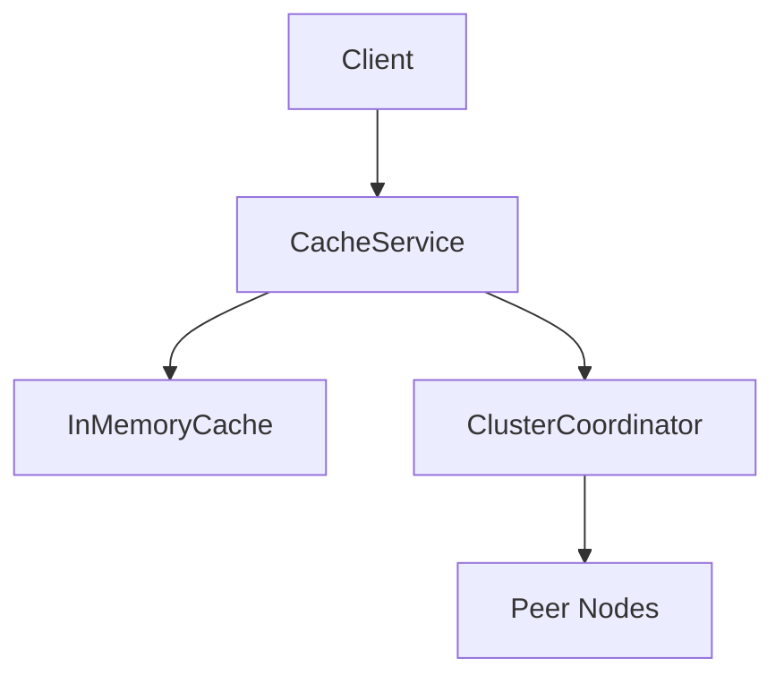

# Documentation Best Practices: Industry Standards vs. Current Approach

## 📊 How Top Tech Companies Organize Documentation

### Industry Leaders' Documentation Structure

#### 1. **Google** (Google Cloud, Android, etc.)
**Structure:**
```
/docs/
  ├── getting-started/
  ├── guides/
  ├── api-reference/
  ├── tutorials/
  ├── examples/
  └── architecture/
```

**Key Practices:**
- **Audience-based organization** (Developers, Admins, End Users)
- **Progressive disclosure** (Start simple, go deeper)
- **Interactive examples** (Try it now buttons)
- **Versioned documentation** (Clear version indicators)
- **Search-first approach** (Powerful search functionality)

#### 2. **Microsoft** (Azure, .NET, etc.)
**Structure:**
```
/docs/
  ├── quickstarts/
  ├── concepts/
  ├── how-to-guides/
  ├── tutorials/
  ├── reference/
  └── samples/
```

**Key Practices:**
- **Task-oriented organization** (How-to guides by task)
- **Conceptual documentation** (Separate from how-to)
- **Code samples** (In every doc, runnable)
- **Multi-language support** (Clear language indicators)
- **Feedback loops** (Rate docs, report issues)

#### 3. **AWS** (Amazon Web Services)
**Structure:**
```
/docs/
  ├── getting-started/
  ├── user-guides/
  ├── developer-guides/
  ├── api-reference/
  ├── cli-reference/
  └── whitepapers/
```

**Key Practices:**
- **Service-based organization** (Each service has its own docs)
- **Role-based navigation** (Developer, Architect, Admin views)
- **Deep linking** (Every section has a permalink)
- **Related content** (See also sections)
- **Last updated dates** (Transparency on freshness)

#### 4. **Netflix** (Open Source Projects)
**Structure:**
```
/docs/
  ├── README.md (Main entry point)
  ├── CONTRIBUTING.md
  ├── ARCHITECTURE.md
  ├── DEPLOYMENT.md
  └── /guides/
      ├── getting-started.md
      ├── configuration.md
      └── troubleshooting.md
```

**Key Practices:**
- **README-first approach** (README is the main hub)
- **Flat structure** (Fewer nested folders)
- **GitHub-native** (Optimized for GitHub browsing)
- **Contributor-focused** (Clear contribution guides)

#### 5. **Kubernetes** (CNCF Project)
**Structure:**
```
/docs/
  ├── concepts/
  ├── tasks/
  ├── tutorials/
  ├── reference/
  └── setup/
```

**Key Practices:**
- **Concept-Task-Reference pattern**
- **Task-based learning paths**
- **Interactive tutorials** (Katacoda, Playground)
- **Community contributions** (Clear contribution process)

---

## 🔍 Common Patterns Across Top Tech Companies

### 1. **Hierarchical Organization**
```
✅ What They Do:
/docs/
  /getting-started/     → First-time users
  /guides/              → Step-by-step instructions
  /reference/           → API/CLI reference
  /examples/            → Code samples
  /architecture/       → Deep technical docs
```

### 2. **Multiple Entry Points**
- **README.md** → Quick overview, links to everything
- **Getting Started** → First-time setup
- **User Guide** → End-user documentation
- **Developer Guide** → Technical deep-dive
- **API Reference** → Complete API documentation

### 3. **Audience Segmentation**
- **End Users** → How to use the product
- **Developers** → How to integrate/extend
- **Administrators** → How to deploy/manage
- **Architects** → How it works internally

### 4. **Progressive Disclosure**
- Start with simple concepts
- Build complexity gradually
- Link to deeper content
- Don't overwhelm with details upfront

### 5. **Living Documentation**
- Versioned alongside code
- Regular updates
- Last updated dates
- Deprecation notices
- Migration guides

---

## 📋 Current Approach Analysis

### ✅ What We're Doing Right

1. **✅ Master Documentation Index**
   - Centralized navigation (MASTER_DOCUMENTATION.md)
   - Categorized by purpose
   - Use case-based navigation
   - **Similar to:** AWS service documentation structure

2. **✅ Audience Segmentation**
   - Getting Started docs for new users
   - Developer guides for integration
   - Production guides for ops
   - **Similar to:** Microsoft's role-based organization

3. **✅ Multiple Entry Points**
   - README.md as main hub
   - QUICK_START.md for fast setup
   - Specialized guides for specific needs
   - **Similar to:** Netflix's README-first approach

4. **✅ Task-Oriented Organization**
   - Integration checklist
   - Step-by-step guides
   - Troubleshooting sections
   - **Similar to:** Kubernetes task-based structure

5. **✅ Version Control Integration**
   - All docs in repository
   - Tracked with code
   - **Similar to:** Industry standard practice

### ⚠️ Areas for Improvement

1. **❌ Folder Structure**
   - **Current:** All docs in root directory (14 files)
   - **Industry Standard:** Organized in `/docs` folder
   - **Impact:** Cluttered root, harder to navigate

2. **❌ Visual Documentation**
   - **Current:** Text-only (minimal diagrams)
   - **Industry Standard:** Diagrams, screenshots, architecture diagrams
   - **Impact:** Harder to understand complex concepts

3. **❌ Interactive Examples**
   - **Current:** Code examples in markdown
   - **Industry Standard:** Runnable examples, interactive tutorials
   - **Impact:** Less engaging, harder to test

4. **❌ Search Functionality**
   - **Current:** Manual navigation via master doc
   - **Industry Standard:** Built-in search (GitHub search, docs site search)
   - **Impact:** Slower to find specific information

5. **❌ Last Updated Tracking**
   - **Current:** Some docs have dates, inconsistent
   - **Industry Standard:** Every doc shows last updated date
   - **Impact:** Hard to know if docs are current

6. **❌ Versioning**
   - **Current:** Single version (1.0.0)
   - **Industry Standard:** Versioned docs (v1, v2, etc.)
   - **Impact:** Hard to maintain multiple versions

---

## 🎯 Recommended Improvements

### Priority 1: Reorganize Folder Structure

**Current Structure:**
```
/
├── README.md
├── QUICK_START.md
├── INSTALLATION.md
├── DEVELOPER_GUIDE.md
├── ... (14 files in root)
└── MASTER_DOCUMENTATION.md
```

**Recommended Structure (Industry Standard):**
```
/
├── README.md (Main entry point with links)
├── CONTRIBUTING.md (If open source)
├── CHANGELOG.md (Version history)
└── docs/
    ├── getting-started/
    │   ├── quick-start.md
    │   ├── installation.md
    │   └── first-steps.md
    ├── guides/
    │   ├── library-usage.md
    │   ├── integration-checklist.md
    │   └── developer-guide.md
    ├── production/
    │   ├── deployment.md
    │   ├── readiness.md
    │   └── monitoring.md
    ├── reference/
    │   ├── api-reference.md
    │   ├── swagger-docs.md
    │   ├── ui-dashboard.md
    │   └── requirements.md
    ├── architecture/
    │   ├── overview.md
    │   ├── design-decisions.md
    │   └── performance.md
    └── maintenance/
        ├── changelog.md
        ├── code-quality.md
        └── quick-fixes.md
```

**Benefits:**
- ✅ Cleaner root directory
- ✅ Logical grouping
- ✅ Easier to navigate
- ✅ Scalable structure

### Priority 2: Enhance README.md

**Current:** Good overview, but could be more comprehensive

**Recommended (Following Netflix/Google pattern):**
```markdown
# Distributed Cache Management System

[Badges: Build Status, Version, License]

## Quick Links
- 🚀 [Getting Started](docs/getting-started/quick-start.md) (5 min)
- 📚 [Full Documentation](docs/README.md)
- 🎯 [API Reference](docs/reference/api-reference.md)
- 🏭 [Production Guide](docs/production/deployment.md)

## What is This?
[Brief 2-3 sentence description]

## Key Features
[Visual feature list with icons]

## Quick Start
[3-step quick start]

## Documentation
[Link to docs/README.md - the new master doc]

## Examples
[Link to examples/]

## Contributing
[Link to CONTRIBUTING.md]

## License
[License info]
```

### Priority 3: Add Visual Documentation

**Recommended Additions:**
1. **Architecture Diagrams**
   - System architecture (Mermaid diagrams)
   - Cluster topology
   - Data flow diagrams

2. **Screenshots**
   - Dashboard UI screenshots
   - Swagger UI examples
   - Configuration examples

3. **Sequence Diagrams**
   - Cache hit/miss flow
   - Cluster communication
   - Invalidation flow

**Example (Using Mermaid in Markdown):**
```markdown
## Architecture


```

### Priority 4: Create docs/README.md

**New Master Documentation Hub:**
- Move MASTER_DOCUMENTATION.md → docs/README.md
- Enhanced with visual navigation
- Add search tips
- Include contribution guidelines

### Priority 5: Add Metadata to All Docs

**Standard Header Template:**
```markdown
---
title: Document Title
last_updated: 2025-11-16
version: 1.0.0
audience: developers
difficulty: intermediate
estimated_time: 20 min
---
```

---

## 📊 Comparison Matrix

| Feature | Current | Industry Standard | Gap |
|---------|---------|-------------------|-----|
| **Folder Structure** | Root-level files | `/docs` folder | ⚠️ Medium |
| **Master Index** | ✅ MASTER_DOC.md | ✅ docs/README.md | ✅ Good |
| **Audience Segmentation** | ✅ Good | ✅ Standard | ✅ Good |
| **Visual Docs** | ❌ Minimal | ✅ Diagrams/screenshots | ⚠️ Medium |
| **Interactive Examples** | ❌ Static | ✅ Runnable | ⚠️ Low |
| **Search** | ❌ Manual | ✅ Built-in | ⚠️ Medium |
| **Versioning** | ⚠️ Partial | ✅ Full versioning | ⚠️ Low |
| **Last Updated** | ⚠️ Inconsistent | ✅ Every doc | ⚠️ Low |
| **Progressive Disclosure** | ✅ Good | ✅ Standard | ✅ Good |
| **Task-Oriented** | ✅ Good | ✅ Standard | ✅ Good |

**Overall Score: 7/10** - Good foundation, needs structural improvements

---

## 🚀 Migration Plan

### Phase 1: Reorganize (1-2 hours)
1. Create `/docs` folder structure
2. Move files to appropriate folders
3. Update all internal links
4. Update README.md with new structure

### Phase 2: Enhance (2-4 hours)
1. Add architecture diagrams
2. Add screenshots to UI docs
3. Create visual navigation
4. Add metadata headers

### Phase 3: Polish (1-2 hours)
1. Add last updated dates
2. Create CONTRIBUTING.md
3. Add search tips
4. Review all links

**Total Time: 4-8 hours**

---

## 🎓 Key Takeaways

### What Top Companies Do Differently:

1. **Organized Folder Structure** → `/docs` folder, not root
2. **Visual Documentation** → Diagrams, screenshots, videos
3. **Multiple Entry Points** → README + docs/README + getting-started
4. **Metadata Tracking** → Last updated, version, audience tags
5. **Interactive Content** → Runnable examples, playgrounds
6. **Search Integration** → Built-in search functionality
7. **Versioning** → Clear version indicators and migration guides

### Your Current Approach:

✅ **Strengths:**
- Good audience segmentation
- Comprehensive master index
- Task-oriented organization
- Multiple entry points

⚠️ **Improvements Needed:**
- Folder organization
- Visual documentation
- Metadata consistency
- Search functionality

---

## 📚 References

- [Google Technical Writing](https://developers.google.com/tech-writing)
- [Microsoft Writing Style Guide](https://docs.microsoft.com/en-us/style-guide/welcome/)
- [AWS Documentation Style Guide](https://docs.aws.amazon.com/general/latest/gr/docstyle.html)
- [Netflix Open Source Documentation](https://netflix.github.io/)
- [Kubernetes Documentation Structure](https://kubernetes.io/docs/)

---

## ✅ Conclusion

**Your current approach is 70% aligned with industry best practices.**

**What's Working:**
- Master documentation index ✅
- Audience segmentation ✅
- Task-oriented organization ✅
- Multiple entry points ✅

**What to Improve:**
- Reorganize into `/docs` folder structure
- Add visual documentation (diagrams, screenshots)
- Enhance README.md as main hub
- Add consistent metadata

**Recommendation:** Implement Phase 1 (reorganization) for immediate improvement, then gradually add visuals and enhancements.

---

**Last Updated:** November 2025  
**Next Review:** After reorganization

