# High-Level System Design

**Version:** 1.0.0  
**Last Updated:** November 2025

> 📊 **Viewing Diagrams:** The diagrams in this document use Mermaid syntax. To see the actual visual diagrams:
> - **🌐 HTML Viewer (Easiest):** Open [`view-diagrams.html`](view-diagrams.html) in your browser - all diagrams rendered instantly!
> - **GitHub/GitLab:** Push to repository and view on web (diagrams render automatically)
> - **VS Code:** Install "Markdown Preview Enhanced" extension
> - **Online:** Copy diagram code to https://mermaid.live/
> - **See:** [`VIEW_DIAGRAMS.md`](VIEW_DIAGRAMS.md) for detailed viewing instructions

---

## 📐 Table of Contents

1. [System Overview](#system-overview)
2. [High-Level Architecture](#high-level-architecture)
3. [Component Architecture](#component-architecture)
4. [Cache Flow Diagrams](#cache-flow-diagrams)
5. [Cluster Communication](#cluster-communication)
6. [Deployment Architecture](#deployment-architecture)
7. [Data Flow Diagrams](#data-flow-diagrams)
8. [Sequence Diagrams](#sequence-diagrams)

---

## System Overview

The Distributed Cache Management System is a **Spring Boot monolith** that provides high-performance, in-memory caching with distributed coordination across multiple JVM instances. It's designed to reduce latency in ticket management systems by caching frequently accessed data.

### Key Characteristics

- **Architecture:** Monolith (single JAR deployed on multiple nodes)
- **Caching Strategy:** In-memory with TTL, LRU/LFU eviction
- **Distribution:** Peer-to-peer cluster coordination
- **Communication:** TCP sockets for inter-node messaging
- **Serialization:** Kryo for efficient data transfer

---

## High-Level Architecture

### System Architecture Diagram


### Architecture Layers


---

## Component Architecture

### Detailed Component Diagram


### Component Responsibilities


---

## Cache Flow Diagrams

### Cache Hit Flow


### Cache Miss Flow (with Thundering Herd Prevention)


### Cache Invalidation Flow


---

## Cluster Communication

### Cluster Topology

```mermaid
graph TB
    subgraph "Cluster Network"
        NODE1[Node 1<br/>localhost:8080<br/>Comm: 9090]
        NODE2[Node 2<br/>localhost:8081<br/>Comm: 9091]
        NODE3[Node 3<br/>localhost:8082<br/>Comm: 9092]
        NODE4[Node 4<br/>localhost:8083<br/>Comm: 9093]
        NODE5[Node 5<br/>localhost:8084<br/>Comm: 9094]
    end
    
    NODE1 <-->|TCP 9090↔9091| NODE2
    NODE2 <-->|TCP 9091↔9092| NODE3
    NODE3 <-->|TCP 9092↔9093| NODE4
    NODE4 <-->|TCP 9093↔9094| NODE5
    NODE1 <-->|TCP 9090↔9092| NODE3
    NODE1 <-->|TCP 9090↔9093| NODE4
    NODE2 <-->|TCP 9091↔9094| NODE5
    
    style NODE1 fill:#e1f5ff
    style NODE2 fill:#e1f5ff
    style NODE3 fill:#e1f5ff
    style NODE4 fill:#e1f5ff
    style NODE5 fill:#e1f5ff
```



### Cluster Discovery and Membership


### Message Flow in Cluster


---

## Deployment Architecture

### Single Node Deployment


### Multi-Node Cluster Deployment


### Network Architecture


---

## Data Flow Diagrams

### Complete Request Flow


### Cache Storage Structure


---

## Sequence Diagrams

### Complete Cache Operation Sequence


### Cluster Startup Sequence


### Cache Replication Sequence


---

## Performance Characteristics

### Latency Breakdown


### Throughput Architecture


---

## Security Architecture

### Security Layers

```mermaid
graph TB
    subgraph "External"
        CLIENT[Client Request]
    end
    
    subgraph "Security Layer"
        AUTH[Basic Authentication<br/>Spring Security]
        VALIDATE[Input Validation<br/>@Valid Annotations]
        RATE[Rate Limiting<br/>Future Enhancement]
    end
    
    subgraph "Application Layer"
        CONTROLLER[REST Controllers]
        SERVICE[Cache Service]
    end
    
    CLIENT --> AUTH
    AUTH -->|Authenticated| VALIDATE
    VALIDATE -->|Valid| CONTROLLER
    CONTROLLER --> SERVICE
    
    style AUTH fill:#FF6B6B
    style VALIDATE fill:#FFE66D
    style CONTROLLER fill:#90EE90
```

---

## Monitoring and Observability

### Metrics Flow

```mermaid
graph LR
    subgraph "Application"
        CS[CacheService]
        CM[CacheManager]
        CC[ClusterCoordinator]
    end
    
    subgraph "Metrics Collection"
        METRICS[CacheMetrics<br/>Micrometer]
        COUNTERS[Counters<br/>Hits, Misses]
        TIMERS[Timers<br/>Load Time]
        GAUGES[Gauges<br/>Size, Memory]
    end
    
    subgraph "Export"
        ACTUATOR[Spring Actuator<br/>/actuator/metrics]
        PROMETHEUS[Prometheus<br/>/actuator/prometheus]
    end
    
    subgraph "Visualization"
        GRAFANA[Grafana<br/>Dashboards]
        ALERTS[AlertManager<br/>Alerts]
    end
    
    CS --> METRICS
    CM --> METRICS
    CC --> METRICS
    
    METRICS --> COUNTERS
    METRICS --> TIMERS
    METRICS --> GAUGES
    
    COUNTERS --> ACTUATOR
    TIMERS --> ACTUATOR
    GAUGES --> ACTUATOR
    
    ACTUATOR --> PROMETHEUS
    PROMETHEUS --> GRAFANA
    PROMETHEUS --> ALERTS
```

---

## Summary

This system design document provides comprehensive visual diagrams of the Distributed Cache Management System architecture. All diagrams use **Mermaid syntax** which renders as actual visual diagrams in:

- ✅ GitHub
- ✅ GitLab
- ✅ Most Markdown viewers
- ✅ Documentation sites (MkDocs, Docusaurus, etc.)
- ✅ VS Code with Markdown Preview Enhanced

### Key Architecture Points

1. **Monolith Design:** Single JAR deployed on multiple nodes
2. **Peer-to-Peer:** Direct TCP communication between nodes
3. **In-Memory Storage:** ConcurrentHashMap for thread-safe access
4. **Thundering Herd Prevention:** Per-key locks with CompletableFuture
5. **Cluster Coordination:** Automatic invalidation/replication
6. **Observability:** Full metrics integration with Prometheus

---

**Last Updated:** November 2025  
**Version:** 1.0.0

